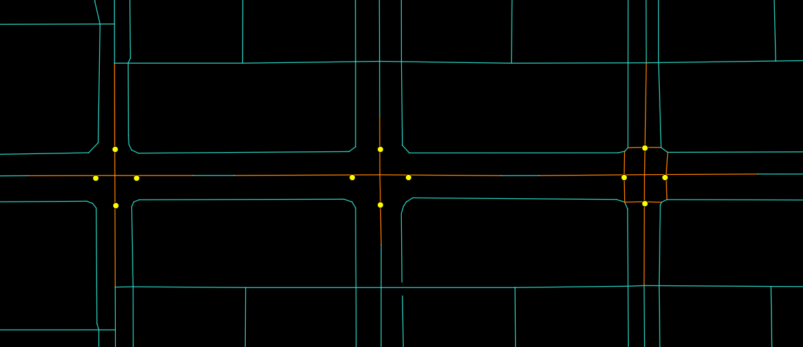
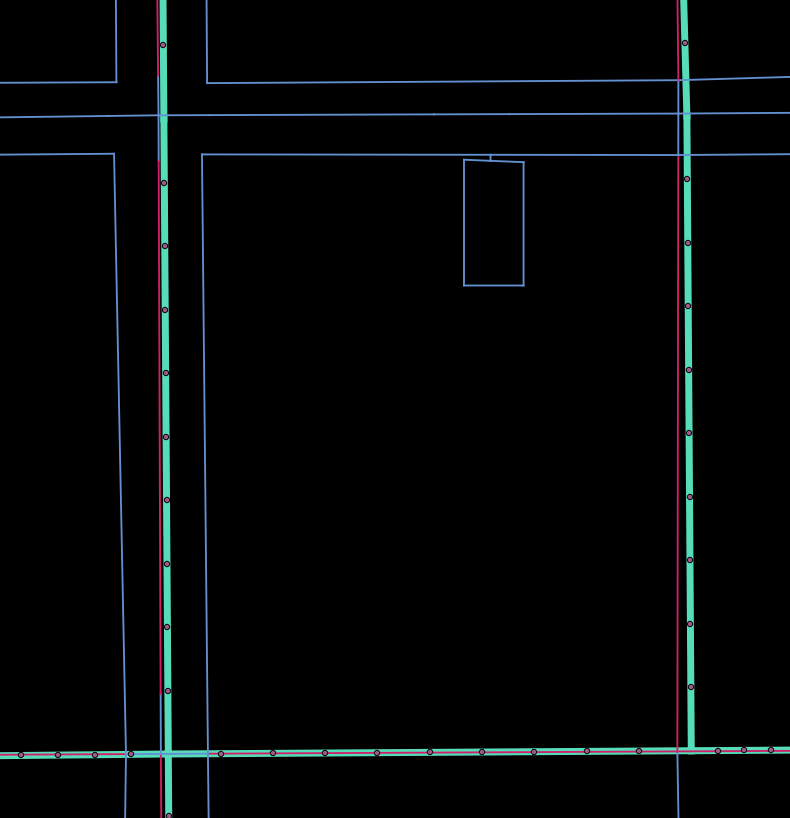
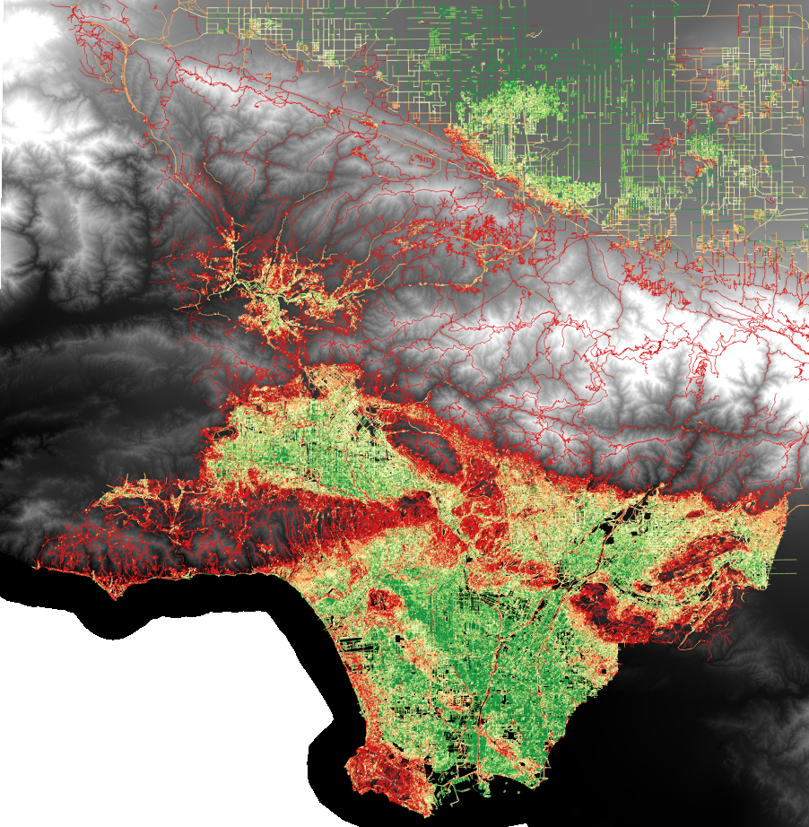
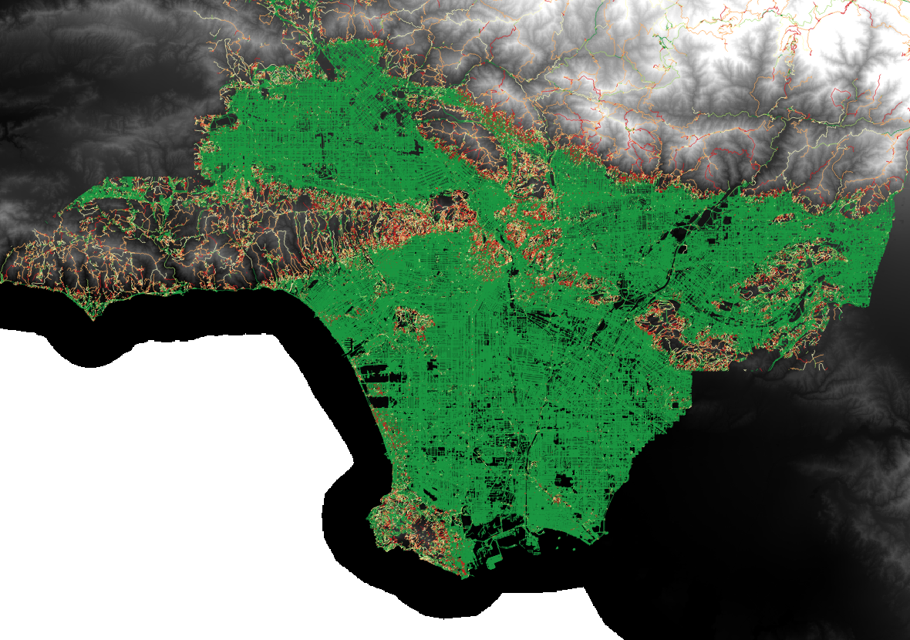
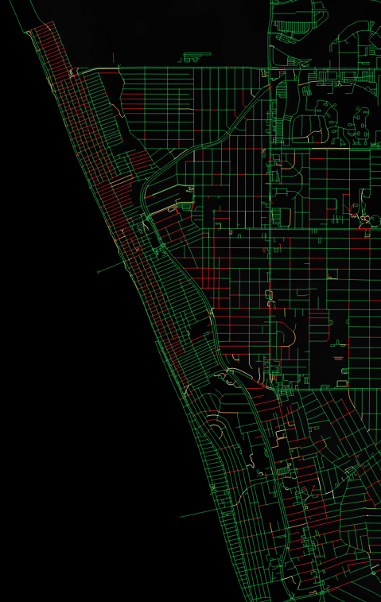

# LADOT Analysis Tool Data Prep

This repository houses Python scripts to build networks and land use data for accessibility applications.

# Setting up your development environment
1. Install Python for your OS ([Anaconda](https://www.anaconda.com/products/individual) strongly recommended).
2. Install [osmosis](https://wiki.openstreetmap.org/wiki/Osmosis/Installation) for your OS.
3. Clone/download this repository and navigate to it from a command line terminal.
4. Install dependencies:

   ```conda env create -f environment.yml```
5. Activate conda environment:

   ```conda activate gencosts```

# Network
The **osm_gen_costs.py** script is designed to generate OSM-based, generalized cost-weighted networks for bicycle and pedestrian accessibility. The generalized cost formulas used here are an adaptation of [Broach (2016)](https://pdxscholar.library.pdx.edu/cgi/viewcontent.cgi?article=3707&context=open_access_etds).  

## How to Build the Network
1. Copy local data files<sup>&dagger;</sup> into the data directory, including:
   - stop signs
   - traffic signalization
   - bikeways
   - crosswalks
   - traffic volume and speed data
2. If working with a static, local OSM extract, put your your .osm file into the data directory as well.
3. To run the analysis with all defaults, simply navigate to the root directory of this repository and execute the following command:
   ```
   python osm_gen_costs.py 
   ```
4. Or specify a place name to test things out on a smaller geographic area:
   ```
   python osm_gen_costs.py -p "Financial District, Los Angeles"
   ```
5. To use a local .osm OSM .pbf file instead of pulling OSM data from on-the-fly, you can use the `-o` flag (or `--osm-filename`):
   ```
   python osm_gen_costs.py -o <your_osm_file.osm.pbf>
   ```
6. Or if you've run this script before, you can save time by using the `-d` flag (or `--dem-filename`) and pointing the script to the elevation data (DEM) .tif that was generated on-the-fly last time the script was run:
   ```
   python osm_gen_costs.py -d <your_dem_file.tif>
   ```
7. If you want your output data as ESRI shapefiles instead of (or in addition to) .pbf, simply use the `-s` flag (or `--save-as`) and the script will generate a shapefile for the edge data.
   ```
   python osm_gen_costs.py -s shp (-s pbf)
   ```
8. The script will then generate an OSM file with the computed attributes stored as new OSM way tags. The following new tags are created by default:
   - `speed_peak:forward` -- speed during hours of peak traffic in the forward direction 
   - `speed_peak:backward` -- speed during hours of peak traffic in the reverse direction 
   - `speed_offpeak:forward` -- speed during offpeak traffic hours in the forward direction
   - `speed_offpeak:backward` -- speed during offpeak traffic hours in the reverse direction
   - `slope_1:forward` -- % distance with 2-4% slope in the forward direction
   - `slope_2:forward` -- % distance with 4-6% slope in the forward direction
   - `slope_3:forward` -- % distance with 6+% slope in the forward direction
   - `slope_4:forward` -- % distance with 10+% slope in the forward direction
   - `slope_1:backward` -- % distance with 2-4% slope in the reverse direction
   - `slope_2:backward` -- % distance with 4-6% slope in the reverse direction
   - `slope_3:backward` -- % distance with 6+% slope in the reverse direction
   - `slope_4:backward` -- % distance with 10+% slope in the reverse direction
   - `self_aadt` -- annual average daily traffic on the edge
   - `cross_aadt:forward` -- annual average daily cross-traffic on the edge in the forward direction
   - `cross_aadt:backward` -- annual average daily cross-traffic on the edge in the reverse direction
   - `parallel_aadt:forward` -- annual average daily parallel-traffic on the edge in the forward direction
   - `parallel_aadt:backward` -- annual average daily parallel-traffic on the edge in the reverse direction
   - `control_type:forward` -- stop sign or traffic signal in the forward direction
   - `control_type:backward` -- stop sign or traffic signal in the reverse direction
   - `bike_infra:forward` -- bike paths, lanes or boulevards in the forward direction
   - `bike_infra:backward` -- bike paths, lanes or boulevards in the reverse direction
   - `unpaved_alley` -- edge is an unpaved alley
   - `busy` -- edge is tertiary road type or above
   - `xwalk:forward` -- crosswalk in the forward direction
   - `xwalk:backward` -- crosswalk in the reverse direction


<sup>&dagger;</sup>Note: Generalized cost generation can be executed without the use of local data by running the script with the `-i` (no infrustructure data) or `-v` (no volume/speed data) flags. If you do want to use local data but your filenames are different from those specified at the top of the script, you can edit them manually there.

## Generalized Costs Calculations

### Bicycle
| Length Adjusted Metric    | Length Multiplier<sup>*</sup> | Variable Name            | Notes                                                                                      |
|---------------------------|-------------------------------|--------------------------|--------------------------------------------------------------------------------------------|
| distance                  | 1.0                           | distance                 |                                                                                            |
| bike boulevard            | -0.108                        | bike_blvd_penalty        | OSM: cycleway="shared" OR LADOT: bikeway=("Route" OR "Shared Route")                       |
| bike path                 | -0.16                         | bike_path_penalty        | OSM: highway="cycleway" OR (highway="path" & bicycle="dedicated") OR LADOT: bikeway="Path" |
| prop link slope 2-4%      | 0.371                         | slope_penalty            | upslope in forward direction, downslope in backward direction                            |
| prop link slope 4-6%      | 1.23                          | slope_penalty            | upslope in forward direction, downslope in backward direction                            |
| prop link slope 6%+       | 3.239                         | slope_penalty            | upslope in forward direction, downslope in backward direction                            |
| no bike lane (10-20k)     | 0.368                         | no_bike_penalty          | OSM: cycleway=(NULL OR "no") OR OSM: bicycle="no" AND LADOT: bikeway=NULL                  |
| no bike lane (20-30k)     | 1.4                           | no_bike_penalty          | OSM: cycleway=(NULL OR "no") OR OSM: bicycle="no" AND LADOT: bikeway=NULL                  |
| no bike lane (30k+)       | 7.157                         | no_bike_penalty          | OSM: cycleway=(NULL OR "no") OR OSM: bicycle="no" AND LADOT: bikeway=NULL                  |

| Fixed Distance Metric  | Addt'l Distance (m)<sup>*</sup> | Variable Name            | Notes                                                                  |
|------------------------|---------------------------------|--------------------------|------------------------------------------------------------------------|
| turns                  | 54                              | turn_penalty             | assume additive ped turn penalty and scale other penalties based on the ratio of the coefficient to the original bike turns coefficient |
| stop signs             | 6                               | stop_penalty             | LADOT datasource: stop_yield                                                    |
| traffic signal         | 27                              | signal_penalty           | LADOT datasource: signalized_intersection                                       |
| cross traffic (5-10k)  | 78                              | cross_traffic_penalty_ls | left or straight only                                                  |
| cross traffic (10-20k) | 81                              | cross_traffic_penalty_ls | left or straight only                                                  |
| cross traffic (20k+)   | 424                             | cross_traffic_penalty_ls | left or straight only                                                  |
| cross traffic (10k+)   | 50                              | cross_traffic_penalty_r  | right only                                                             |
| parallel traffic (10-20k) | 117                        | parallel_traffic_penalty | left only                                                                                            |
| parallel traffic (20k+)   | 297                         | parallel_traffic_penalty | left only                                                                                           |

<sup>*</sup>Multipliers and distances inspired by Broach (2016)

| Generalized Cost       | Formula                                                                                                                    |
|------------------------|----------------------------------------------------------------------------------------------------------------------------|
| gen_cost_bike:link     | distance + distance * (bike_blvd_penalty + bike_path_penalty + slope_penalty + no_bike_penalty) |
| gen_cost_bike:left     | turn_penalty + stop_penalty + signal_penalty + cross_traffic_penalty_ls + parallel_traffic_penalty|
| gen_cost_bike:straight | stop_penalty + signal_penalty + cross_traffic_penalty_ls|
| gen_cost_bike:right    | turn_penalty + stop_penalty + signal_penalty + cross_traffic_penalty_r |

#### Examples:
| | South Budlong Ave. | Baxster Street | 
|--|--|--|
|Way ID |[165344383](https://www.openstreetmap.org/way/165344383#map=19/33.97519/-118.29605)| [161705335](https://www.openstreetmap.org/way/161705335)
| From Node | 123058787 | 5531221585 |
| To Node | 123058790 | 26187155 |
| Length | 89.023 | 225.923 |
| gen_cost_bike:forward:link	| 89.023 | 818.9850357 |
| gen_cost_bike:forward:left	| 81 | 60 |
| gen_cost_bike:forward:straight	| 27 | 6 |
| gen_cost_bike:forward:right	| 54 | 54 |
| gen_cost_bike:backward:link	| 89.023 | 193.018 |
| gen_cost_bike:backward:left	| 60 | 60 |
| gen_cost_bike:backward:straight	| 6 | 6 |
| gen_cost_bike:backward:right	| 54 | 54 |
| slope_penalty:forward | 0 | 3.243050056 |
| slope_penalty:backward | 0 | 0 |
| bike_path_penalty:forward | 0 | 0 |
| bike_path_penalty:backward | 0 | 0 |
| bike_blvd_penalty:forward | 0 | 0 |
| bike_blvd_penalty:backward | 0 | 0 |
| signal_penalty:forward | 0.021 | 0 |
| signal_penalty:backward | 0 | 0 |
| stop_sign_penalty:forward | 0 | 0.005 |
| stop_sign_penalty:backward | 0.005 | 0.005 |

### Pedestrian

| Length Adjusted Metric  |   Length Multiplier<sup>*</sup> | Variable Name         | Notes                                                                                                                                                                     |
|-------------------------|---------------------------------|-----------------------|---------------------------------------------------------------------------------------------------------------------------------------------------------------------------|
| distance                | 1.0                             | distance              |                                                                                                                                                                           |
| prop link slope 10%+    | 0.99                            | ped_slope_penalty     | upslope for forward direction, downslope for backward direction                                                                                                           |
| unpaved or alleyway     | 0.51                            | unpaved_alley_penalty | OSM: highway="alley" OR surface="unpaved"                                                                                                                                 |
| busy street             | 0.14                            | busy_penalty          | OSM: highway=('tertiary' OR 'tertiary_link' OR 'secondary' OR 'secondary_link' OR 'primary' OR 'primary_link' OR 'trunk' OR 'trunk_link' OR 'motorway' OR 'motorway_link' |

| Fixed Distance Metric            | Addt'l Distance (m)<sup>*</sup> | Variable Name              | Notes                                                                                                                                                                                   |
|----------------------------------|---------------------------------|----------------------------|-----------------------------------------------------------------------------------------------------------------------------------------------------------------------------------------|
| turn                             | 54                              | turn_penalty               |                                                                                                                                                                                         |
| unsignalized arterial crossing   | 73                              | unsig_art_xing_penalty     | left or right: ((13000 <= parallel traffic AADT <= 23000) OR (13000 <= self-edge AADT <= 23000)) AND (unsignalized) straight: (13000 <= cross traffic AADT <= 23000) AND (unsignalized) |
| collector crossing w/o crosswalk | 28                              | unmarked_coll_xing_penalty | left or right: ((10000 <= parallel traffic AADT < 13000) OR (10000 <= self-edge AADT < 13000)) AND (no crosswalk) straight: (10000 <= cross traffic AADT < 13000) AND (no crosswalk)    |

<sup>*</sup>Multipliers and distances inspired by Broach (2016)

| Generalized Cost      | Formula                                                                                    |
|-----------------------|--------------------------------------------------------------------------------------------|
| gen_cost_ped:link     | distance + distance * (slope_penalty + unpaved_alley_penalty + busy_penalty + nbd_penalty) |
| gen_cost_ped:left     | turn_penalty + unsig_art_xing_penalty + unmarked_coll_xing                                 |
| gen_cost_ped:straight | turn_penalty + unsig_art_xing_penalty + unmarked_coll_xing                                 |
| gen_cost_ped:right    | turn_penalty + unsig_art_xing_penalty + unmarked_coll_xing                                 |

#### Examples:
| | Lanark Street|
|--|--|
|Way ID | [13356087](https://www.openstreetmap.org/way/13356087)|
|From Node | 123018756 |
|To Node | 368008589 |
|gen_cost_ped:forward:link |	54.416 |
|gen_cost_ped:forward:left |	54 |
|gen_cost_ped:forward:straight |	0 |
|gen_cost_ped:forward:right |	54 |
|gen_cost_ped:backward:link |	54.416 |
|gen_cost_ped:backward:left |	54 |
|gen_cost_ped:backward:straight |	73 |
|gen_cost_ped:backward:right |	54 |
|unsig_art_xing_penalty_lr:forward | 0 |
|unsig_art_xing_penalty_s:forward | 0 |
|unsig_art_xing_penalty_lr:backward | 0 |
|unsig_art_xing_penalty_s:backward | 73 |
|unmarked_coll_xing_penalty_lr:forward | 0 |
|unmarked_coll_xing_penalty_s:forward | 0 |
|unmarked_coll_xing_penalty_lr:backward | 0 |
|unmarked_coll_xing_penalty_s:backward | 0 |
|ped_slope_penalty:forward | 0 |
|ped_slope_penalty:backward | 0 |
|unpaved_alley_penalty | 0 |
|busy_penalty | 0 |

## Control Type Assignment

### Stop Signs
Currently stop sign designations are assigned at the intersection level, meaning if there is any stop sign at an intersection, all edges terminating at that intersection are assigned a stop sign penalty:


## Pedestrian Infrastructure Assignment

### Crosswalks
Crosswalk assignment currently works like stop sign assignment described above. If there is a crosswalk at an intersection, all edges terminating at that intersection are assigned a crosswalk penalty:


If OSM has footway edges representing the crosswalks, then those footways will be associated with the crosswalk, as seen in the right-most intersection above. Otherwise, the crosswalks will be associated with the roadway edges as seen in the two intersections to the left.

## Bicycle Infrastructure Assignment

### Bike Lanes
Bike infrastructure is assigned by converting LADOT Bikeways lines to points, and then snapping those points to the OSM network:


^ Above, LADOT Bikeways are shown in teal, with OSM ways shown in pink where they have been assigned bicycle infrastructure and blue where they have not.

## Slope Computation
<p align="center">
   
</p>

### Examples
The following images show the LA county OSM roads colored from green to red based on the percentage of each OSM way that has a slope >= 6%:

1. This county-wide map shows roads with the highest percentage of slopes >6% clustered around the the foothills of the Santa Monica and San Gabriel mountain ranges, as expected:

   

2. A more detailed view shows the severity of the slopes of streets leading down to sea level near Manhattan Beach:

   

3. A third image highlights the slopes of roads to the NW of Dodger Stadium, including the infamously inclined [Baxter Street](https://www.laweekly.com/this-super-steep-echo-park-street-is-hell-on-earth-for-cars/):

   
 
# Land Use Data
The following datasets are used by Conveyal to define "opportunities" for computing accessibilities and are not required for computing generalized costs on the travel network:
   - **Land Use** - Additional land use data for use in Conveyal Analysis are available on the project sharepoint site.  Their contents have been documented in the LADOT_landuse_data_inventory.xlsx file also on the sharepoint site.
   - **Census** - The script to generate Census-based population and household data stored as shapefiles is located in the `scripts/` directory of this repository. The latest data as of March 2020 is included on the sharepoint site.
